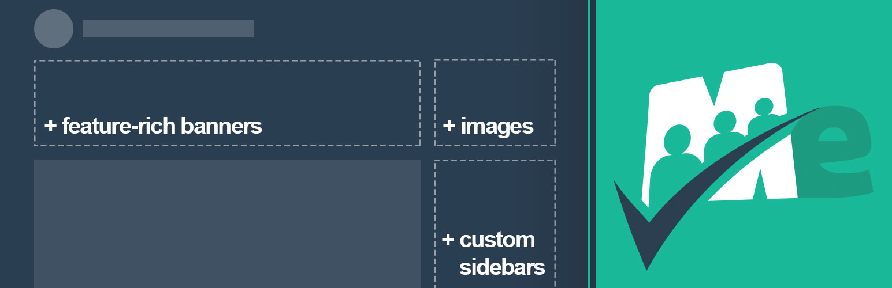

# [Memberlite Elements](https://memberlitetheme.com/memberlite-elements/) #

  

### Welcome to the Memberlite Elements GitHub Repository
For sites running the [Memberlite Theme](https://memberlitetheme.com/) or a Memberlite Child Theme, this plugin enhances your site with custom Masthead Page Banners, Unique Sidebar and Widget Areas, and Membership Level Landing Pages.

[Memberlite](https://memberlitetheme.com) is the ideal theme for your membership site - packed with integration for top membership site plugins including [Paid Memberships Pro](https://wordpress.org/plugins/paid-memberships-pro/). It's fully customizable with your logo, colors, fonts, custom sidebars, and more global layout settings.

For more information please visit [the elements documentation page at the Memberlite Theme website](https://memberlitetheme.com/memberlite-elements/).

## Installation ##
For detailed installation steps, visit the [documentation](https://memberlitetheme.com/memberlite-elements/) page.

1. Download the current development ZIP file directly: `https://github.com/strangerstudios/memberlite-elements/archive/dev.zip`

**Please ensure that once installing this version of the plugin to remove `-dev` from the plugin's folder name.**

## Bugs ##
If you find an issue/bug, let us know by [creating a detailed GitHub issue](https://github.com/strangerstudios/memberlite-elements/issues/new).

## Support ##
This is a developer's portal for Memberlite Elements. We do not offer support on this channel. **Any support related questions should be directed to [the Memberlite Theme website](https://memberlitetheme.com/).**

## Contributing to Memberlite Elements ##
We encourage and welcome any contribution to Memberlite Elements. Please read the [guidelines for contributing](https://github.com/strangerstudios/memberlite-elements/blob/dev/.github/CONTRIBUTING.md) to this repository.

There are various **ways to help development** of Memberlite Elements:

1. Report [bugs/issues](https://github.com/strangerstudios/memberlite-elements/issues/new) on GitHub.
2. Work on any issues by submitting a Pull Request.

Here are some ways for **non-developers to contribute** to Memberlite Elements:

1. Translate Memberlite Elements into your own [language](https://translate.wordpress.org/projects/wp-plugins/memberlite-elements/).
2. Leave an honest review for [Memberlite Elements](https://wordpress.org/support/plugin/memberlite-elements/reviews/#new-post).
